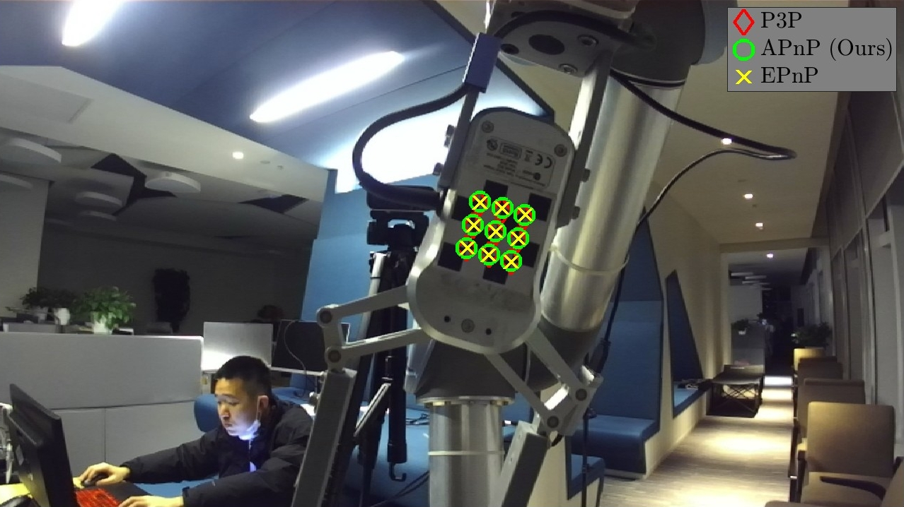

# Algebraic Perspective-n-Points (APnP)
This algorithm aims to give fast and reliable camera pose estimation from 2-D/3-D correspondences. The codes provide the experimental results of the dataset in Tencent Robotics X Laboratory. The results show that the APnP is significantly better than P3P and EPnP. 


# Usage 
```git clone https://github.com/zarathustr/APnP```

Clone the data via:

```cd APnP && git submodule update --init --recursive```


Run file ``pnp_zed_M_left_merged_corners.m`` with MATLAB of version over ``R2020b``. Then visualize the PnP pose estimation and reprojected chessboard corners. 




# Reference
Wu, J., Wang, C., et al. (2024) On Similarity Transformation Problems: Globally Optimal Results and Applications. ***IEEE Transactions on Instrumentation and Measurement***. https://doi.org/10.1109/TIM.2024.3438850

# Contact
Corresponding author: Prof. Chaoqun Wang, Shandong University, China, e-mail: zychaoqun@gmail.com

Code contributor: Jin Wu, HKUST, e-mail: jin_wu_uestc@hotmail.com

The experiments were carried out in Tencent Robotics X Laboratory during 2019 to 2020, Shenzhen, China.

